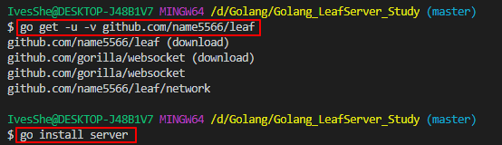
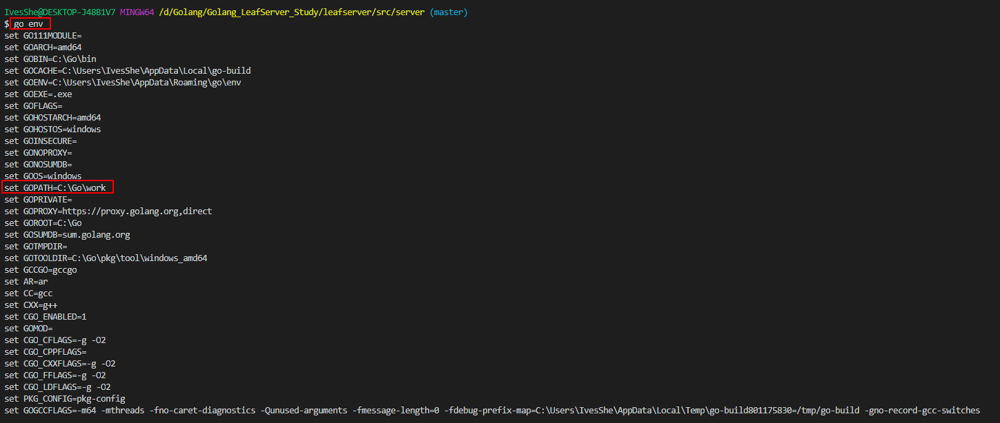
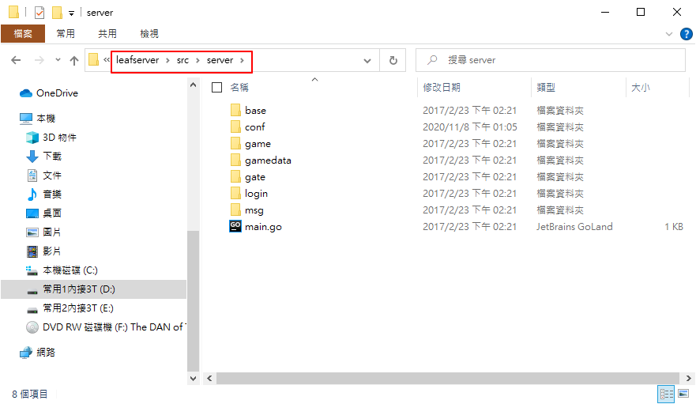
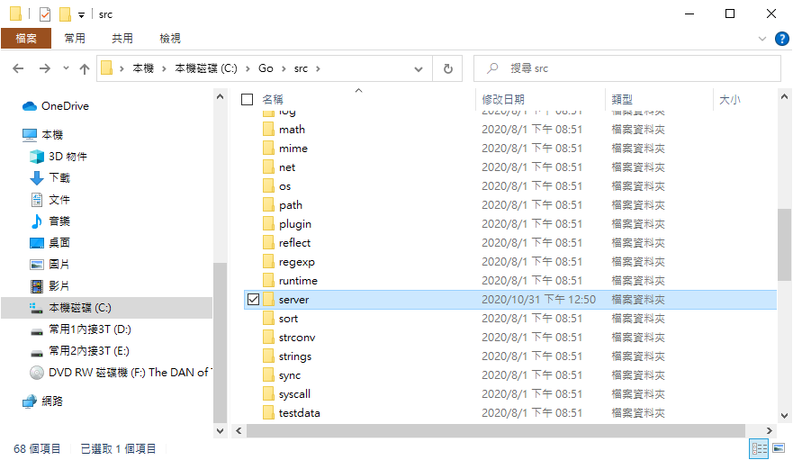
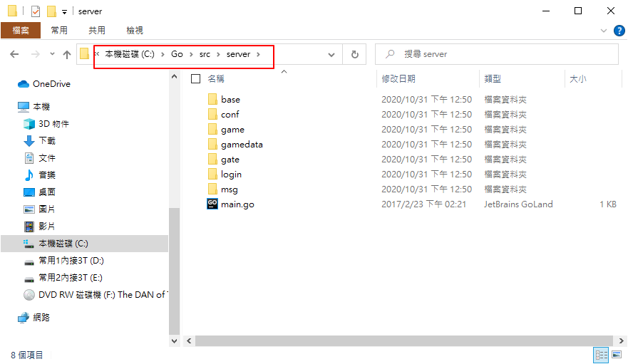
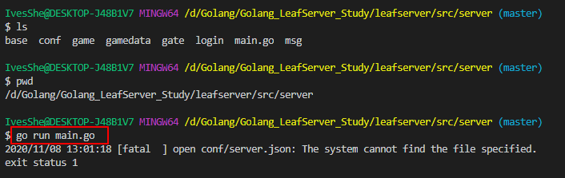
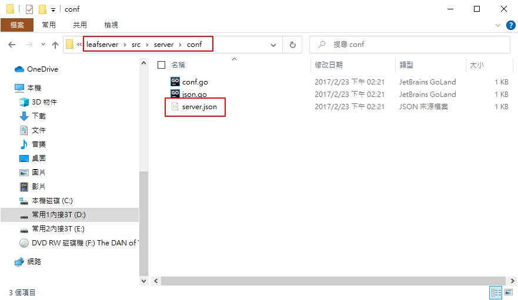
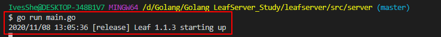

# Golang LeafServer Study

# 下載並安裝

```bash
go get -u -v github.com/name5566/leaf
```

# 編譯LeafServer

```bash
go install server
```




# 需手動拷貝lefasserver的server目錄到GoPath的目錄

查看環境

```bash
go  env
```










# 執行

```bash
go run main.go
```

發覺少了server.json




手動拷貝



順利執行




# 參考資料

https://github.com/name5566/leaf/blob/master/TUTORIAL_ZH.md

[Golang 游戏leaf系列(一) 概述与示例](https://www.jianshu.com/p/8e33823f2479)

[Golang 游戏leaf系列(二) 网络消息流程概述](https://www.jianshu.com/p/c2585b5a0d1f)

[Golang 游戏leaf系列(三) NewAgent在chanrpc和skeleton中怎么通讯](https://www.jianshu.com/p/00313d3d7960)

[Golang 游戏leaf系列(四) protobuf数据怎么处理](https://www.jianshu.com/p/217f4d1a9e4e)

[Golang 游戏leaf系列(五) chanrpc三种调用模式](https://www.jianshu.com/p/37b2c724da54)

[Golang 游戏leaf系列(六) Go模块](https://www.jianshu.com/p/af17a869f4f0)

[Golang 游戏leaf系列(七) 监听关闭](https://www.jianshu.com/p/51c0448e6afc)

[Golang 游戏leaf系列(八) 输出错误日志stacktrace](https://www.jianshu.com/p/1d0a5c49ecf4)

[Golang 游戏leaf系列(九) 官方issues摘录](https://www.jianshu.com/p/042e9b643d1b)

[leaf 和cocos creator 游戏实战（一）使用protobuf完成通讯](https://blog.csdn.net/ouzhengai/article/details/81050692)

[leaf 和cocos creator 游戏实战（二）注册与登陆](https://blog.csdn.net/ouzhengai/article/details/81836955)


